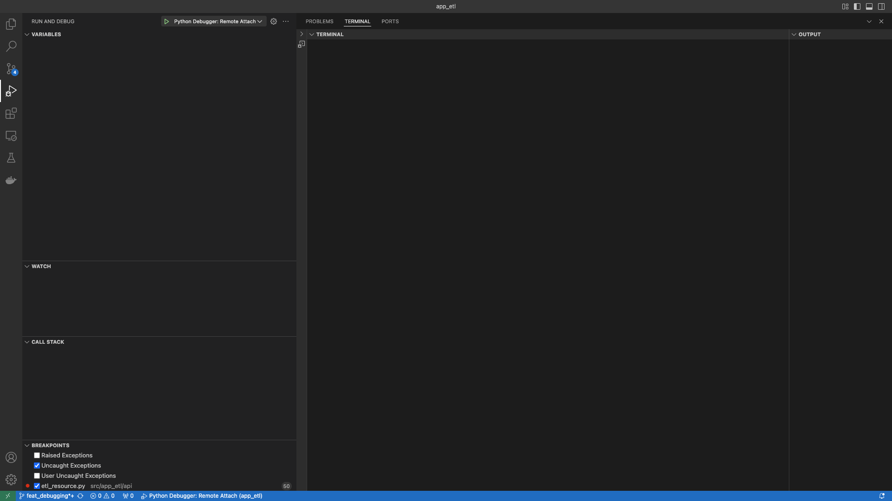

# app_etl


An API driven ETL program to extract data from Wworld Health Organization.

## Supported Datasets:
- Malaria Annual Confirmed Cases
- ...

## project structure:
- docs: project documentation lives in here.
- src: production code lives in folder and is divided in the modules below:
    - app_etl: project package
        - api:
            - the API to the application lives in this module.
            - the current implementation is a REST API, but a gRPC, CLI API, etc would be implemented in here.
        - config:
            - configurable values live in here.
            - these are values such as Hand Ranks, Card Ranks.
                - as the system scales, you could migrate these into a database to allow independently
                changing config without restarting the application.
        - core:
            - the domain logic of the application lives in this module.
        - gateway:
            - all external interaction objects(e.g. files, external APIs etc) live in this module.
        - model:
            - the domain models for Poker live in this in this module.
        - app.py:
            entry point to startup the application
- tests: test code lives in folder.
    the tests are intentionally separated from production code.
    - benefits:
        - tests can run against an installed version after executing `pip install .`.
        - tests can run against the local copy with an editable install after executing `pip install --edit`.
        - when using Docker, the entire app_etl folder can be copied without needing to exclude tests, which we don't release to PROD.
    - more in depth discussion here: https://docs.pytest.org/en/latest/explanation/goodpractices.html#choosing-a-test-layout-import-rules

- utilities: any useful scripts, such as curl & postman requests, JSON payloads, software installations, etc.

## setup instructions:
1. install `python 3.11` or higher.
    - [Python Download](https://www.python.org/downloads/)

2. clone repo:
    ```shell
    git clone git@github.com:praisetompane-toy-applications/app_etl.git
    ```
## package management:
- install pipenv: https://pypi.org/project/pipenv/

- install packages into local environment using pipenv[**only required for first run**]:
    ```shell
    pipenv 
    ```
## run program:
- to start system:
    ```shell
    ./start_system.sh
    ```
- run ETL
    ```shell
    # specifically imports malaria_annual_confirmed_cases
    ./utilities/curl/malaria/malaria_annual_confirmed_cases.sh
    ```

## testing:
### unit tests:
- to run tests:
    - activate environment
    ```shell
    pipenv shell
    ```
    - run tests
    ```shell
    pytest
    ```

### end to end tests:
- The curl request used can be found in `utilities/curl/`.
    - example:
    ```shell
    ./utilities/curl/highest_rank/royal_flush.sh
    ```
     <br>

- If Postman requests can be found in `/utilities/postman/app_etl.postman_collection.json`.
    
    - Guide for how to import into Postman: https://learning.postman.com/docs/getting-started/importing-and-exporting/importing-data/


## development:
- to run system in debug mode:
    ```shell
    ./start_system.sh
    ```
- running in VSCode:
    - open the "Run and Debug" view:
    - click the green play button.
        - the server will inform you the host and port in the terminal output at the bottom.
        - from here you debug like normal(i.e. add break points, step into code definitions, evaluate code snippets, etc)
    
## git conventions:
- **NB:** the master is locked and all changes must come through a Pull Request.
- commit messages:
    - provide concise commit messages that describe what you have done.
        ```shell
        # example:
        git commit -m "feat(core): algorithm" -m"implement my new shiny faster algorithm"
        ```
    - screen shot of Githb view
    - references:
        - https://www.conventionalcommits.org/en/v1.0.0/
        - https://www.freecodecamp.org/news/how-to-write-better-git-commit-messages/
## demo:

**Disclaimer**: This is still work in progress.
