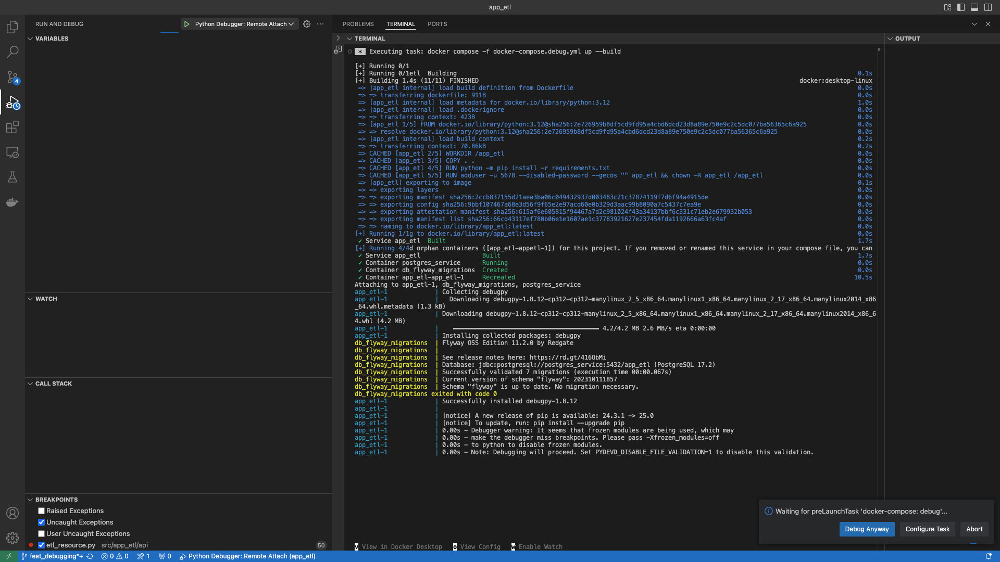

# app_etl


##  Objective:

A toy API driven ETL program to extract data from World Health Organization.

## Supported Datasets:
- Malaria Annual Confirmed Cases
- ...

## project structure:
- docs: project documentation lives in here.
- src: production code lives in folder and is divided in the modules below:
    - app_etl: project package
        - api:
            - the API to the application lives in this module.
            - the current implementation is a REST API, but a gRPC, CLI API, etc would be implemented in here.
        - config:
            - configurable values live in here.
            - these are values such as Hand Ranks, Card Ranks.
                - as the system scales, you could migrate these into a database to allow independently
                changing config without restarting the application.
        - core:
            - the domain logic of the application lives in this module.
        - gateway:
            - all external interaction objects(e.g. files, external APIs etc) live in this module.
        - model:
            - The domain models for Poker live in this in this module.
        - repository:
            - Data interactions(persitence and access) concerns live in this module.
        - app.py:
            entry point to startup the application
- tests: test code lives in folder.
    the tests are intentionally separated from production code.
    - benefits:
        - tests can run against an installed version after executing `pip install .`.
        - tests can run against the local copy with an editable install after executing `pip install --edit`.
        - when using Docker, the entire app_etl folder can be copied without needing to exclude tests, which we don't release to PROD.
    - more in depth discussion here: https://docs.pytest.org/en/latest/explanation/goodpractices.html#choosing-a-test-layout-import-rules

- utilities: any useful scripts, such as curl & postman requests, JSON payloads, software installations, etc.

## Setup Instructions:
- Install [Docker](https://docs.docker.com/get-started/)
- The repository is configured to use [devcontainers](https://containers.dev) for development.
    - [Developing inside a Container](https://code.visualstudio.com/docs/devcontainers/containers)

## Run Program:
- The system automatically starts up as part of loading the project into an editor that supports devcontainers.
    - If you wouuld like to run the prod image, change `dockerfile: Dockerfile.dev` to `dockerfile: Dockerfile` in [docker-compose](docker-compose.debug.yml).
- Run an ETL
    ```shell
    # specifically imports malaria_annual_confirmed_cases
    ./utilities/curl/malaria/malaria_annual_confirmed_cases.sh
    ```

## Testing:
- ### Run unit and integration tests:
    ```shell
    pytest
    ```
- ### end to end tests:
    - Not Implemented

## Debugging:
- Running in debug mode and debug with VSCode:
    - Open the "Run and Debug" view.
    - Click the green play button.<br>
        <br>
    - Allow debugging without frozen modules by clicking "Debug Anyway" once the debugger is installed and ready.
        
    - The server will inform you the host and port in the terminal output at the bottom.<br>
    - From here you debug like normal(i.e. add break points, step into code definitions, evaluate code snippets, etc) <br>

- If you wouuld like to debug the prod image, change `dockerfile: Dockerfile.dev` to `dockerfile: Dockerfile` in [docker-compose.debug](docker-compose.debug.yml).


## Database State Management:

- The database state (i.e. tables, stored procedures, indexes, etc) are managed using [Alembic](https://alembic.sqlalchemy.org/en/latest/).
    - Migrations location: src/app_etl/migrations
    - Migrations naming scheme: YYYY_MM_DD_HHMM_rev_nanme
        - uses alembic's full revision scheme defined in alembic.ini
        - example: `2025_02_08_0825-98af2865f6fc_create_schema_etl`
    - Current database state can be queried with `SELECT * FROM public.alembic_version;`
- To upgrade the database to latest migrations:
    ```shell
    alembic upgrade head
    ```
- To downgrade the database to the base state:
    ```shell
    alembic downgrade base
    ```

## Git Conventions:
- **NB:** The main is locked and all changes must come through a Pull Request.
- Commit Messages:
    - Provide concise commit messages that describe what you have done.
        ```shell
        # example:
        git commit -m "feat(core): algorithm" -m"implement my new shiny faster algorithm"
        ```
    - screen shot of Githb view
    - references:
        - https://www.conventionalcommits.org/en/v1.0.0/
        - https://www.freecodecamp.org/news/how-to-write-better-git-commit-messages/
## demo:

**Disclaimer**: This is still work in progress.
